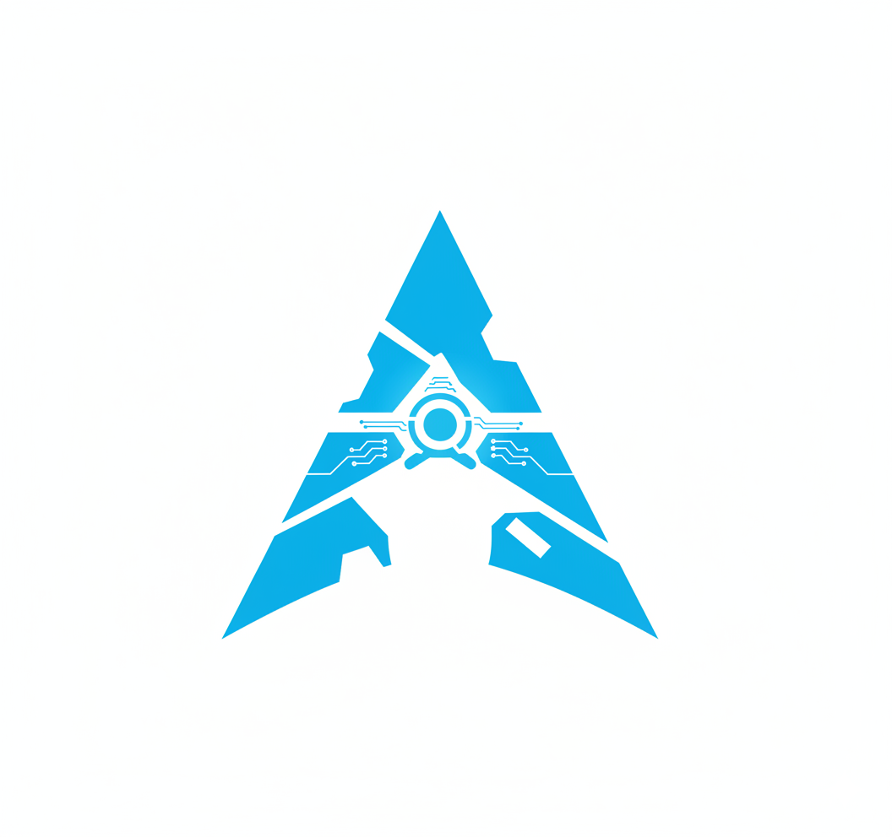
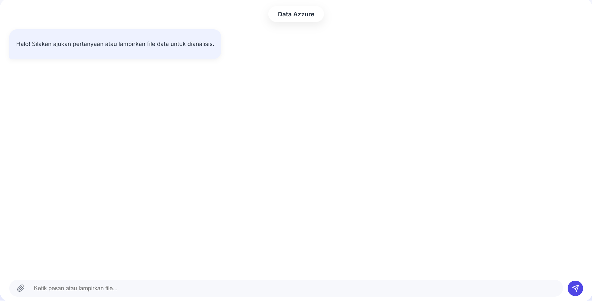

<div align="center">

# ✨ Data Azzure v2 ✨

**Sebuah antarmuka chat yang cerdas, ringan, dan modern untuk menganalisis data Anda secara instan.**

</div\>

<p align="center">

<p>

-----

<p align="center">

<p>

## 🚀 Tentang Proyek Ini

**Data Azzure** adalah sebuah aplikasi web frontend murni yang dirancang untuk menjadi jembatan antara Anda dan data Anda. Proyek ini menyediakan antarmuka obrolan (chat interface) yang bersih dan intuitif di mana Anda dapat:

  * **Mengajukan pertanyaan** tentang data Anda dalam bahasa alami.
  * **Mengunggah file data** (seperti `.csv`, `.json`, `.xls`, dll.) untuk dianalisis secara langsung.
  * Menerima wawasan dan analisis mendalam yang ditenagai oleh backend AI/Otomatisasi (seperti n8n yang terhubung ke Azure OpenAI atau LLM lainnya).

Aplikasi ini dibuat agar ringan, cepat, dan mudah di-deploy, hanya menggunakan HTML, CSS, dan JavaScript murni (Vanilla).

## ✨ Fitur Utama

  * **Antarmuka Chat Modern:** UI yang bersih, responsif, dan terinspirasi dari "Dynamic Island" untuk pengalaman pengguna yang menyenangkan.
  * **Upload File:** Lampirkan file data Anda dengan mudah langsung dari jendela obrolan.
  * **Render Markdown:** Balasan dari bot secara otomatis di-render dari Markdown ke HTML, mendukung tabel, daftar, dan format teks lainnya berkat `Showdown.js`.
  * **Manajemen Sesi:** Setiap sesi obrolan diberi ID unik untuk pelacakan konteks di backend.
  * **Backend Agnostik:** Didesain untuk berkomunikasi dengan *endpoint* webhook apa pun. Konfigurasi default ditujukan untuk **n8n**.
  * **Zero Dependencies (Hampir):** Tidak memerlukan framework JavaScript yang berat. Hanya `Showdown.js` (dari CDN) untuk rendering Markdown.

## 🔧 Tumpukan Teknologi (Tech Stack)

  * **Frontend:** HTML5, CSS3 murni, JavaScript murni (ES6+).
  * **Markdown-to-HTML:** [Showdown.js](https://github.com/showdownjs/showdown).
  * **Backend (Tujuan):** Didesain untuk [n8n.io](https://n8n.io/) (atau webhook kustom lainnya).

## ⚙️ Bagaimana Cara Kerjanya?

Arsitektur aplikasi ini sangat sederhana namun kuat:

1.  **Input Pengguna:** Pengguna mengetik pesan atau melampirkan file.
2.  **Kirim ke Webhook:** Data (pesan teks, file, dan `sessionId`) dibundel ke dalam `FormData`.
3.  **Fetch API:** Data dikirim menggunakan `fetch` ke `N8N_WEBHOOK_URL` yang telah ditentukan. Kunci API opsional (`X-API-KEY`) juga dapat disertakan dalam header.
4.  **Proses Backend (n8n):** Alur kerja (workflow) n8n Anda menerima data ini. Di sinilah keajaiban terjadi—Anda dapat meneruskan data ke Azure OpenAI, LangChain, atau layanan pemrosesan data lainnya.
5.  **Terima Balasan:** n8n mengirimkan kembali respons JSON dengan properti `reply` yang berisi teks dalam format Markdown.
6.  **Render UI:** `index.html` menerima respons, mengubah Markdown menjadi HTML menggunakan `Showdown.js`, dan menampilkannya sebagai pesan bot di obrolan.

## 🛠️ Instalasi & Konfigurasi

Proyek ini adalah **Frontend Murni**. Untuk membuatnya berfungsi, Anda *harus* mengonfigurasi backend (alur kerja n8n) Anda sendiri.

### Langkah 1: Dapatkan Frontend

1.  Clone repositori ini:
    ```bash
    git clone https://github.com/daffasdev-lang/dataazurev2.git
    cd dataazurev2
    ```
2.  Tidak perlu instalasi `npm`. Cukup buka `index.html` di browser Anda (disarankan melalui server lokal).

### Langkah 2: Konfigurasi Backend (Sangat Penting)

1.  Buka file `index.html`.

2.  Temukan blok `<script>` di bagian bawah.

3.  Edit variabel-variabel konfigurasi ini:

    ```javascript
    // --- KONFIGURASI WAJIB ---
    const N8N_WEBHOOK_URL = 'https://devdaffas-n8n-free.hf.space/webhook-test/azuredata'; // <-- GANTI DENGAN URL WEBHOOK N8N ANDA
    const API_KEY = ''; // <-- ISI JIKA WEBHOOK ANDA MEMERLUKAN KUNCI API
    // -------------------------
    ```

      * `N8N_WEBHOOK_URL`: Ganti ini dengan URL webhook produksi dari alur kerja n8n Anda. Alur kerja Anda harus dikonfigurasi untuk menerima `message`, `file`, dan `sessionId`.
      * `API_KEY`: Jika Anda mengamankan webhook n8n Anda dengan kunci API (melalui *HTTP Header*), masukkan kuncinya di sini.

### Langkah 3: Jalankan Aplikasi

Untuk menjalankan aplikasi secara lokal (dan menghindari masalah CORS), gunakan server web sederhana:

```bash
# Jika Anda memiliki Python 3
python -m http.server

# Atau gunakan ekstensi VS Code seperti "Live Server"
```

Buka `http://localhost:8000` (atau port yang sesuai) di browser Anda, dan Anda siap untuk mulai\!

## 🤝 Berkontribusi

Merasa ada yang bisa ditingkatkan? Kontribusi sangat kami hargai\!

1.  Fork repositori ini.
2.  Buat *branch* fitur baru (`git checkout -b fitur/perbaikan-keren`).
3.  Lakukan perubahan Anda.
4.  Commit perubahan Anda (`git commit -m 'Menambahkan fitur keren'`).
5.  Push ke *branch* Anda (`git push origin fitur/perbaikan-keren`).
6.  Buka Pull Request.

## 📄 Lisensi

Proyek ini dilisensikan di bawah Lisensi MIT. Lihat file `LICENSE` untuk detail lebih lanjut.

